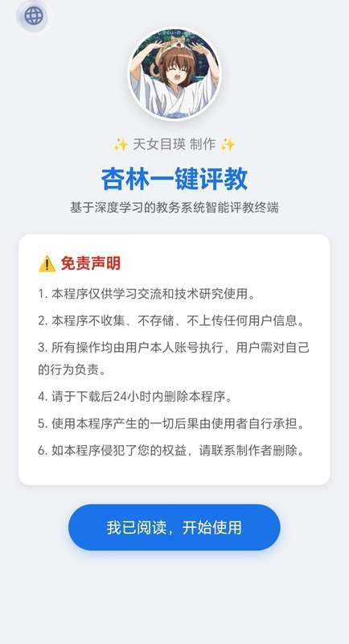
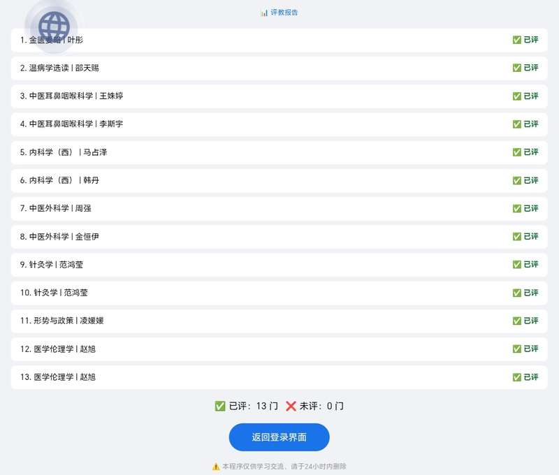

# 杏林一键评教 🎓

> ✨ 天女目瑛 制作 ✨

一学期一次的评教又要开始了

愤怒的瑛学姐表示
又要给十几个老师评教
每个老师都要打好几十个勾
实在是太反人类啦！

试想，
一名同学被耽误一小时
那全校同学加在一起
那还了得

于是昨晚（其实是今天凌晨）
熬夜进行开发
推出了这款安卓APP

大小仅48kb
登陆后能在几秒内
完成原本需要一小时的评教工作

自动破解中途的验证码
并完成提交

瑛学姐现在将这款APP开源了
可以给我个Star吗？❤️

辽宁中医药大学 - 教务系统一键评教工具

## 📱 效果展示

### 首页界面



### 评教完成报告


## ⚠️ 免责声明

1. 本程序仅供学习交流和技术研究使用
2. 本程序不收集、不存储、不上传任何用户信息
3. 所有操作均由用户本人账号执行，用户需对自己的行为负责
4. **请于下载后24小时内删除本程序**
5. 使用本程序产生的一切后果由使用者自行承担
6. 如本程序侵犯了您的权益，请联系制作者删除

## 📱 使用方法

1. 下载 `杏林一键评教.apk`
2. 在手机上安装（需要允许"安装未知来源应用"）
3. 打开APP，阅读免责声明并点击"我已阅读，开始使用"
4. 输入学号和密码，点击登录
5. APP自动完成登录、同意声明、评教全过程
6. 查看评教报告，确认结果

## 🏗️ 从源码编译

### 环境要求
- JDK 17+
- Android SDK build-tools (aapt, apksigner)
- d8/r8 (DEX编译器)
- android.jar (API 23, 来自 android-sdk-platform-23)

### Ubuntu/Debian 安装依赖
```bash
apt install openjdk-17-jdk-headless aapt apksigner android-sdk-platform-23
# 下载 r8.jar (d8)
curl -L -o /tmp/r8.jar 'https://dl.google.com/dl/android/maven2/com/android/tools/r8/8.5.35/r8-8.5.35.jar'
```

### 编译步骤
```bash
bash 构建脚本.sh
```

或手动编译：
```bash
# 1. 编译Java
javac -cp android.jar -d build app源码/MainActivity.java

# 2. 编译DEX
java -cp r8.jar com.android.tools.r8.D8 --output build/dexout --lib android.jar build/com/tianvmu/jiaolin/MainActivity.class

# 3. 打包资源
aapt package -f --min-sdk-version 23 -M app源码/AndroidManifest.xml -S app源码/res -A app源码/assets -I android.jar -F build/app.apk

# 4. 添加DEX
cd build && aapt add app.apk classes.dex

# 5. 生成密钥并签名
keytool -genkeypair -keystore debug.keystore -alias androiddebugkey -keyalg RSA -keysize 2048 -validity 10000 -storepass android -keypass android -dname 'CN=Android Debug,O=Android,C=US'
jarsigner -verbose -sigalg SHA256withRSA -digestalg SHA-256 -keystore debug.keystore -storepass android -keypass android app.apk androiddebugkey
```

## 📂 项目结构

```
杏林一键评教/
├── README.md                    ← 本文件
├── screenshot_home.jpg          ← 首页截图
├── screenshot_report.jpg        ← 报告页截图
├── 杏林一键评教.apk             ← 成品APK（直接安装用）
├── 构建脚本.sh                   ← 一键编译APK脚本
├── app源码/
│   ├── MainActivity.java        ← APP核心（WebView壳子+自动化逻辑）
│   ├── AndroidManifest.xml      ← APP清单文件
│   ├── assets/
│   │   ├── www/index.html       ← UI界面（首页+登录页）
│   │   ├── avatar.jpg           ← 天女目瑛头像
│   │   └── jsencrypt.min.js     ← RSA加密库（学校原版）
│   └── res/
│       ├── mipmap/ic_launcher.png  ← APP图标
│       └── values/                ← 字符串和样式资源
└── 已编译APK/
    └── 杏林一键评教.apk          ← 同样一份APK
```

## 🔧 技术原理

### 架构：WebView自动化
APP本质是一个WebView，直接加载学校网页，注入JS自动操作。
Cookie、ASP.NET状态、表单提交全部由浏览器原生处理，不会出错。

### 核心技术
1. **RSA加密**：用学校页面的JSEncrypt库加密密码
2. **验证码绕过**：不调用checkLogin()，自己加密后直接submit()
3. **ASP.NET表单**：手动添加Button1隐藏字段，让服务器识别登录按钮
4. **状态机评教**：init→switching→scoring→saved→report，用localStorage跨页面保持进度
5. **记住密码**：SharedPreferences存储账号密码

## 📝 开源协议

本项目采用 **AGPL v3** 协议开源。

任何人可以自由使用、修改和分发本项目，但修改后的版本也必须以 AGPL v3 协议开源，且通过网络提供服务时也必须公开源代码。

详情请参阅 [LICENSE](LICENSE) 文件。
